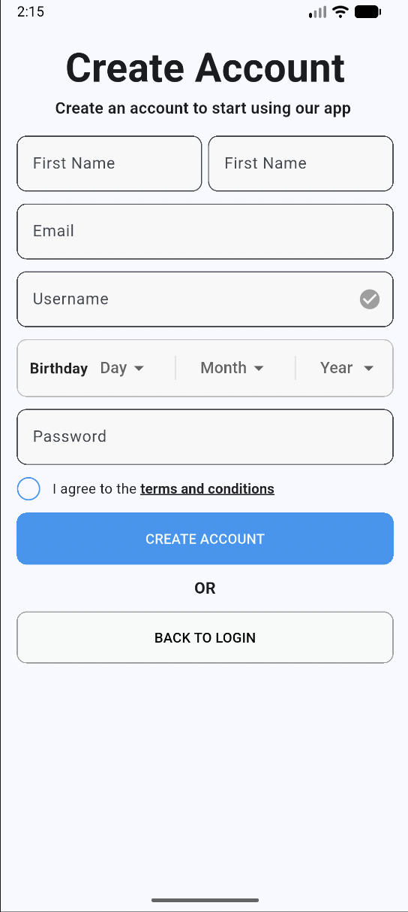

# Custom Circle Checkbox UI in Flutter

A beautiful, pixel-perfect custom **Circular Checkbox UI** implemented in Flutter. This component fixes the default limitations of Flutter's `CheckboxListTile`, allowing complete control over the layout, sizing, and removing unnecessary button padding for clickable text links.

---

## UI Screenshot

Here is the final look of the implemented UI design:



---

## Features Implemented

* **Custom Circular Checkbox:** Migrated from standard rectangle shape to a perfect `CircleBorder()`.
* **Dynamic Sizing & Color:** Utilized `Transform.scale` to resize the checkbox without losing precision, maintaining strict custom blue coloring.
* **No Extra Gaps:** Handled custom `TextButton` styling (`padding: EdgeInsets.zero`, `minimumSize: Size.zero`, and `shrinkWrap`) to completely eliminate unnatural spacing between regular text and hyperlinks.
* **Seamless Layout:** Constructed using a flexible `Row` and `Expanded` hierarchy to prevent screen clipping or alignment issues.

---

## Code Structure Overview

Here is a snippet of how the clean UI is structured in this project:

```dart
Row(
  mainAxisAlignment: MainAxisAlignment.start,
  crossAxisAlignment: CrossAxisAlignment.center,
  children: [
    SizedBox(
      height: 24,
      width: 24,
      child: Transform.scale(
        scale: 1.3,
        child: Checkbox(
          value: agreeTerms,
          activeColor: Colors.blue,
          checkColor: Colors.white,
          shape: const CircleBorder(),
          side: const BorderSide(color: Colors.blue, width: 2),
          onChanged: (value) {
            // State management logic
          },
        ),
      ),
    ),
    const SizedBox(width: 12),
    Expanded(
      child: Row(
        children: [
          const Text("I agree to the "),
          TextButton(
            style: TextButton.styleFrom(
              padding: EdgeInsets.zero,
              minimumSize: Size.zero,
              tapTargetSize: MaterialTapTargetSize.shrinkWrap,
            ),
            onPressed: () {},
            child: const Text("terms and conditions"),
          ),
        ],
      ),
    ),
  ],
)
```

---

## How to Run

1. **Clone the repository:**
   ```bash
   git clone https://github.com/mazbaul20/Flutter-registration-screen
   ```
2. **Navigate into the directory:**
   ```bash
   cd Flutter-registration-screen
   ```
3. **Get dependencies:**
   ```bash
   flutter pub get
   ```
4. **Run the application:**
   ```bash
   flutter run
   ```
